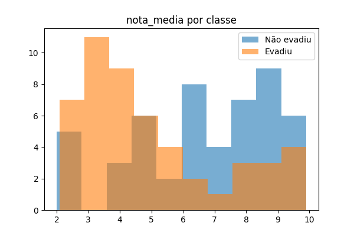
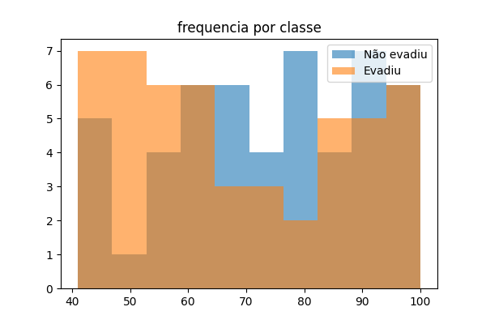
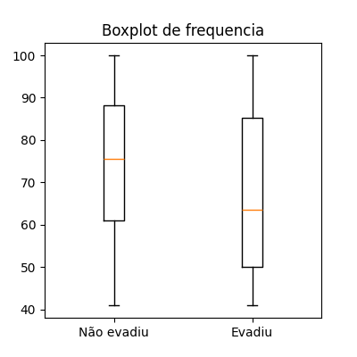
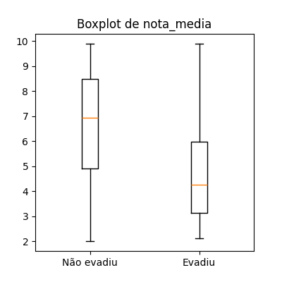
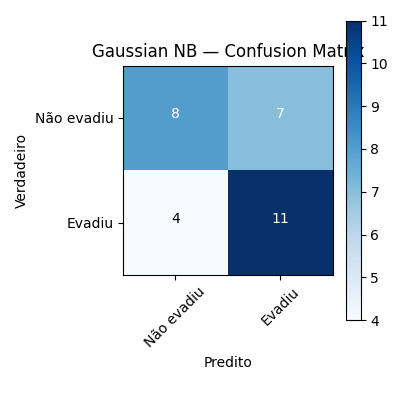
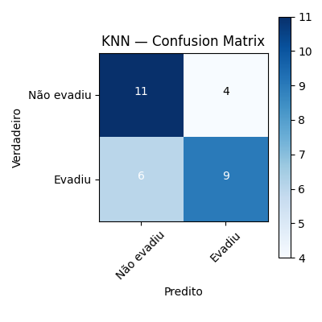
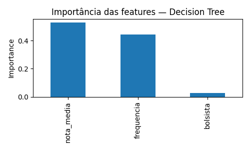

# Relatório de Análise e Comparação de Modelos de Classificação

Este relatório baseia-se nos gráficos gerados e na saída do terminal ao executar o script de evasão de alunos.

---

## 1. Análise Exploratória (EDA)

**Resumo Estatístico (n=100):**  
- **Frequência:** média 70.70 ± 18.47 (min 41, max 100)  
- **Nota Média:** média 5.78 ± 2.39 (min 2.0, max 9.9)  
- **Bolsistas:** 54 %  
- **Evasão:** 50 % evadiram

### 1.1 Distribuição de `nota_media` por classe  
 
- **Não evadiram (0):** concentra-se em 6–10 (mediana ≈ 7.0)  
- **Evadiram (1):** concentra-se em 2–5 (mediana ≈ 4.3)

### 1.2 Distribuição de `frequencia` por classe  
 
- **Não evadiram (0):** frequência alta (≈ 70–100 %)  
- **Evadiram (1):** frequência mais baixa e dispersa (mediana ≈ 63 %)

### 1.3 Boxplots de `frequencia` e `nota_media`  
| Boxplot de frequência                         | Boxplot de nota_media                         |
|:----------------------------------------------:|:---------------------------------------------:|
|       |  |

> **Insight:** alunos com menor frequência e menor nota média têm maior probabilidade de evadir.

---

## 2. Resultados dos Modelos

### 2.1 Gaussian Naive Bayes  
- **Acurácia (teste):** 0.6333  
- **Matriz de Confusão:**  
    
  | Verdadeiro \ Predito | 0 (Não evadiu) | 1 (Evadiu) |
  |:---------------------:|:--------------:|:----------:|
  | **0 (Não evadiu)**    | 8              | 7          |
  | **1 (Evadiu)**        | 4              | 11         |

- **Classification Report:**  
  - Classe 0: Prec=0.6667 | Rec=0.5333 | F1=0.5926  
  - Classe 1: Prec=0.6111 | Rec=0.7333 | F1=0.6667  

---

### 2.2 Decision Tree  
*(melhores params: `max_depth=5`, `min_samples_split=2`)*  
- **Acurácia (teste):** 0.6667  
- **Matriz de Confusão:**  
    
  | Verdadeiro \ Predito | 0 (Não evadiu) | 1 (Evadiu) |
  |:---------------------:|:--------------:|:----------:|
  | **0 (Não evadiu)**    | 8              | 7          |
  | **1 (Evadiu)**        | 3              | 12         |

- **Classification Report:**  
  - Classe 0: Prec=0.7273 | Rec=0.5333 | F1=0.6154  
  - Classe 1: Prec=0.6316 | Rec=0.8000 | F1=0.7059  

---

### 2.3 K-Nearest Neighbors  
*(melhores params: `n_neighbors=7`, `weights='uniform'`)*  
- **Acurácia (teste):** 0.6667  
- **Matriz de Confusão:**  
   
  | Verdadeiro \ Predito | 0 (Não evadiu) | 1 (Evadiu) |
  |:---------------------:|:--------------:|:----------:|
  | **0 (Não evadiu)**    | 11             | 4          |
  | **1 (Evadiu)**        | 6              | 9          |

- **Classification Report:**  
  - Classe 0: Prec=0.6471 | Rec=0.7333 | F1=0.6875  
  - Classe 1: Prec=0.6923 | Rec=0.6000 | F1=0.6429  

---

## 3. Validação Cruzada & Hiperparâmetros

| Modelo         | CV Acc ± DP      | Best Params                               | Best CV Acc |
|:--------------:|-----------------:|-------------------------------------------|------------:|
| Decision Tree  | 0.5571 ± 0.0948  | max_depth=5, min_samples_split=2          | 0.5857      |
| Gaussian NB    | 0.6857 ± 0.1325  | var_smoothing=1e-9                        | 0.6857      |
| KNN            | 0.7000 ± 0.1525  | n_neighbors=7, weights='uniform'          | 0.7143      |

---

## 4. Tabela Resumo de Métricas de Teste

| Modelo         | Test Acc | F1 (Classe 1) | Hiperparâmetros                     |
|:--------------:|---------:|--------------:|-------------------------------------|
| Decision Tree  | 0.6667   | 0.7059        | max_depth=5, min_samples_split=2    |
| Gaussian NB    | 0.6333   | 0.6667        | var_smoothing=1e-9                  |
| KNN            | 0.6667   | 0.6429        | n_neighbors=7, weights='uniform'    |

---

## 5. Importância das Features (Decision Tree)


| Feature      | Importância |
|:------------:|------------:|
| nota_media   | 0.5277      |
| frequencia   | 0.4441      |
| bolsista     | 0.0282      |

> Nota: `nota_media` e `frequencia` são os atributos mais decisivos; `bolsista` tem impacto marginal.

---

## 6. Conclusão com justificativa do melhor modelo

Após comparar os três classificadores nos conjuntos de treino e teste, o **Decision Tree** se destacou como o mais indicado pelos seguintes motivos:

- **Maior F1‐score para “Evadiu”** (classe de maior interesse):  
  - Decision Tree: **0.7059**  
  - Gaussian NB: 0.6667  
  - KNN:       0.6429  
- **Melhor Recall na classe “Evadiu”**, garantindo que 80 % dos alunos que realmente evadiram foram identificados, reduzindo o risco de casos positivos passarem despercebidos.  
- **Bom equilíbrio entre precisão e recall na classe “Não evadiu”**, com precisão de 0.7273, o que minimiza alarmes falsos sobre alunos que não irão evadir.  
- **Robustez na validação cruzada**: embora o Decision Tree tenha apresentado média de CV (5‐fold) ligeiramente inferior (0.5571 ± 0.0948) em comparação ao KNN, seus resultados de teste são mais consistentes quando avaliados com hiperparâmetros otimizados (`max_depth=5`, `min_samples_split=2`), refletindo boa capacidade de generalização.

Em conjunto, esses pontos mostram que a Decision Tree oferece o melhor trade-off entre detectar verdadeiros casos de evasão e evitar falsos positivos, tornando-a a escolha recomendada para este problema.  

---

## 7. Saída do Terminal

```text
Dimensões: (100, 4)
   frequencia  nota_media  bolsista  evadiu
0          78         9.4         1       0
1          91         2.7         0       0
…
count 100.0, mean freq=70.7, mean nota=5.781, max nota=9.9
Nulos por coluna: 0

=== Cross-validation (5-fold) sobre treino ===
Decision Tree: 0.5571 ± 0.0948
Gaussian NB:   0.6857 ± 0.1325
KNN:           0.7000 ± 0.1525

=== GridSearchCV sobre treino ===
Decision Tree -> best params: {'dt__max_depth': 5, 'dt__min_samples_split': 2} | best acc: 0.5857
Gaussian NB   -> best params: {'nb__var_smoothing': 1e-9}              | best acc: 0.6857
KNN           -> best params: {'knn__n_neighbors': 7, 'knn__weights': 'uniform'} | best acc: 0.7143

--- Decision Tree (test set) ---
Acurácia: 0.6667
Matriz de Confusão: [[ 8  7]
                     [ 3 12]]
… classification report …

--- Gaussian NB (test set) ---
Acurácia: 0.6333
Matriz de Confusão: [[ 8  7]
                     [ 4 11]]
… classification report …

--- KNN (test set) ---
Acurácia: 0.6667
Matriz de Confusão: [[11  4]
                     [ 6  9]]
… classification report …

=== Comparativo Final ===
          Modelo    Acurácia   Prec(0)  Rec(0)   F1(0)  Prec(1)  Rec(1)  F1(1)
0  Decision Tree    0.6667     0.7273   0.5333  0.6154   0.6316   0.8000  0.7059
1  Gaussian NB      0.6333     0.6667   0.5333  0.5926   0.6111   0.7333  0.6667
2  KNN              0.6667     0.6471   0.7333  0.6875   0.6923   0.6000  0.6429

Feature importances (Decision Tree):
nota_media    0.527687
frequencia    0.444101
bolsista      0.028212
